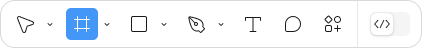
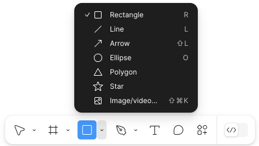

# Cоздание  интерактивных компонентов в графическом редакторе Figma (версия  124.5.5)

Перед созданием компонентов создайте фрейм:
1. На панели инструментов снизу выберите  **Frame** (горячая клавиша  **F**).

    
2. Кликните на рабочую область и потяните курсор.
 
Настройка параметров фрейма, а также других инструментов осуществляется на панели справа.

## Чекбокс
1.  На панели инструментов снизу выберите  **Rectangle** (горячая клавиша  **R**) и создайте чекбокс необходимого размера.

    
   
2. На панели инструментов снизу выберите  **Line** (горячая клавиша  **L**) и нарисуйте галочку внутри чекбокса.
3. Создайте компонент, для этого выделите чекбокс и галочку, нажмите правой кнопкой мыши и выберите **Create component**.
4. Создайте вариант неотмеченного чекбокса, для этого нажмите правой кнопкой мыши по компоненту и выберите **Main component** → **Add variant**. Удалите галочку в созданном варианте.
5. На панели справа выберите вкладку **Prototype**. Наведите курсор на один из вариантов чекбокса, нажмите на появившийся синий кружок и соедините со вторым вариантом. Нажмите на стрелку и в меню **Interaction** укажите значения:

   |Поле|Значение| 
   |:--:|:------:|
   |Trigger|On tap|
   |Action|Change to|
   |Animation|Instant|

   Повторите соединение и настройку взаимодействия для второго варианта чекбокса. 

6. Скопируйте чекбокс и вставьте его в свой прототип.
7. Запустите прототип, для этого на панели справа нажмите значок . Проверьте чекбокс: при клике внутри чекбокса должна появляться галочка.

## Переключатель

1. На панели инструментов снизу выберите  **Rectangle** (горячая клавиша  **R**) и создайте прямоугольник необходимого размера. Для скруления углов прямоугольника на панели справа в блоке **Appearance** в поле  **Corner radius** укажите значение радиуса скругления.
2. На панели инструментов снизу выберите  **Ellipse** (горячая клавиша  **O**) и создайте круг, расположите его внутри прямоугольника. 
3. На панели справа в блоке **Fill** установите цвета для прямоугольника и круга переключателя в состоянии «включен». 
4. Создайте компонент, для этого выделите прямоугольник и круг, нажмите правой кнопкой мыши и выберите **Create component**.
5. Создайте вариант переключателя в состоянии «выключен», для этого нажмите правой кнопкой мыши по компоненту и выберите **Main component** → **Add variant**. Переместите круг на противоположную сторону прямоугольника и на панели справа в блоке **Fill** измените цвета элементов.
6. На панели справа выберите вкладку **Prototype**. Наведите курсор на один из вариантов  переключателя, нажмите на появившийся синий кружок и соедините со вторым вариантом. Нажмите на стрелку и в меню **Interaction** укажите значения:
   |Поле|Значение| 
   |:--:|:------:|
   |Trigger|On tap|
   |Action|Change to|
   |Animation|Smart animate|
   |Curve|Linear|
 
 Повторите соединение и настройку взаимодействия для второго варианта переключателя.

7. Скопируйте переключатель и вставьте его в свой прототип.
8. Запустите прототип, для этого на панели справа нажмите значок . Проверьте переключатель: при клике он должен плавно переключаться из одного состояния в другое.

## Раскрывающееся меню

1. На панели инструментов снизу выберите  **Frame** (горячая клавиша  **F**) и создайте фрейм для одного пункта меню. 
2. На панели инструментов снизу выберите  **Text** (горячая клавиша  **T**) и добавьте текст пункта меню. 
3. Создайте компонент, для этого выделите фрейм с текстом, нажмите правой кнопкой мыши и выберите **Create component**.
4. Создайте вариант пункта меню при наведении курсора, для этого нажмите правой кнопкой мыши по компоненту и выберите **Main component** → **Add variant**. На панели справа в блоке **Fill** измените цвета элементов.
5. На панели справа выберите вкладку **Prototype**. Наведите курсор на неактивный вариант пункта меню, нажмите на появившийся синий кружок и соедините со вторым вариантом. Нажмите на стрелку и в меню **Interaction** укажите значения:
   |Поле|Значение| 
   |:--:|:------:|
   |Trigger|While hovering|
   |Action|Change to|
   |Animation|Instant|
  
6. На панели справа выберите вкладку **Design**. Создайте меню, для этого скопируйте и вставьте друг под другом необходимое количество неактивных пунктов меню. С помощью инструмента    **Text** измените текст каждого пункта меню. Объедините меню во фрейм, для этого выделите все пункты меню, нажмите правой кнопкой мыши и выберите **Frame selection**.
7. Под фреймом меню вставьте готовую кнопку раскрывающегося меню или создайте ее, для этого на панели инструментов снизу выберите  **Line** (горячая клавиша  **L**) и нарисуйте горизонтальную линию, скопируйте и дважды вставьте друг под другом на одинаковом расстоянии. Объедините линии в группу, для этого выделите все линии, нажмите правой кнопкой мыши и выберите **Group selection**. 
8. Объедините меню и кнопку во фрейм, для этого этого выделите фрейм меню и кнопку, нажмите правой кнопкой мыши и выберите **Frame selection**.
9. Создайте компонент, для этого выделите фрейм с меню и кнопкой, нажмите правой кнопкой мыши и выберите **Create component**.
10. Создайте вариант закрытого меню, для этого нажмите правой кнопкой мыши по компоненту и выберите **Main component** → **Add variant**. Выберите фрейм с пунктами меню, на панели инструментов снизу выберите  **Scale** (горячая клавиша  **K**) и уменьшите размер фрейма до кнопки меню. Сделайте фрейм  с пунктами меню прозрачным, для этого на панели справа в блоке **Appearance** в поле **Opacity** установите значение **0%**. Кнопку меню оставьте без изменений.
11. На панели справа выберите вкладку **Prototype**. Наведите курсор на кнопку меню во фрейме с раскрывающимся меню, нажмите на появившийся синий кружок и соедините с фреймом с закрытым меню. Нажмите на стрелку и в меню **Interaction** укажите значения:

    |Поле|Значение| 
    |:--:|:------:|
    |Trigger|On tap|
    |Action|Change to|
    |Animation|Smart animate|
    |Curve|Linear|

12. Повторите соединение и настройку взаимодействия для кнопки меню во фрейме с закрытым меню с фреймом с раскрывающимся меню.
13. Скопируйте фрейм с закрытым меню и вставьте его в свой прототип.
14. Запустите прототип, для этого на панели справа нажмите значок . Проверьте меню: при клике на кнопку должно раскрываться меню, при наведении курсора на пункт меню должен меняться его цвет. 
